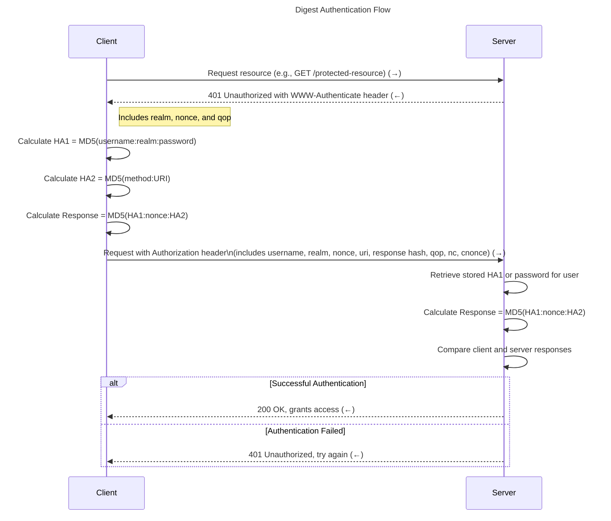

## Digest



## Digest Authentication Flow between Server (Camera) and Client (RP5)

To mimic a Digest Authentication flow between a **Server (camera)** and a **Client (RP5)**, with the password set to `"Pass"`, here’s how each step would look in practice:

---

### Initial Setup

- **Client (RP5)** username: `user1`
- **Password**: `Pass`
- **Realm**: `"cameraRealm"` (defines the protection space, usually a server-defined string)
- **Nonce**: Server-generated unique value, e.g., `"randomNonce123"`

### Digest Authentication Steps

1. **Client (RP5) Requests Resource**:
   - **Client (RP5)**: Sends a request to the **Server (camera)** without any authentication header.
   - **Example Request**: `GET /stream`

2. **Server (Camera) Responds with a 401 Unauthorized and Sends a Digest Authentication Challenge**:
   - **Server (camera)**: Returns `401 Unauthorized` and includes a `WWW-Authenticate` header:

     ```plaintext
     HTTP/1.1 401 Unauthorized
     WWW-Authenticate: Digest realm="cameraRealm", nonce="randomNonce123", qop="auth"
     ```

3. **Client (RP5) Calculates the Hashes**:
   - **Client (RP5)** now calculates the following to respond to the server challenge:
     - **HA1**:

       ```plaintext
       HA1 = MD5("user1:cameraRealm:Pass")
       ```

       Suppose this results in: `94a0d7a680dd21e1a2b99f5b411ecb8a`.
     - **HA2**:

       ```plaintext
       HA2 = MD5("GET:/stream")
       ```

       Suppose this results in: `d41d8cd98f00b204e9800998ecf8427e`.
     - **Response**:

       ```plaintext
       Response = MD5("94a0d7a680dd21e1a2b99f5b411ecb8a:randomNonce123:d41d8cd98f00b204e9800998ecf8427e")
       ```

       Suppose this results in: `5d41402abc4b2a76b9719d911017c592`.

4. **Client (RP5) Sends the Hashed Response**:
   - **Client (RP5)** sends a new request with an `Authorization` header containing the hashed response:

     ```plaintext
     GET /stream HTTP/1.1
     Authorization: Digest username="user1", realm="cameraRealm", nonce="randomNonce123",
     uri="/stream", response="5d41402abc4b2a76b9719d911017c592", qop=auth, nc=00000001, cnonce="clientNonce"
     ```

5. **Server (Camera) Validates the Response**:
   - **Server (camera)** uses its stored password for `user1` (i.e., `"Pass"`) to generate `HA1` and calculate its own `Response` value. It then compares this value with the `response` sent by the client.
   - If the values match, the **Server (camera)** grants access.

6. **Access Granted or Denied**:
   - If the **Server (camera)** calculates a matching response, it sends back a `200 OK` and allows **Client (RP5)** to access the resource.
   - If the response does not match, the **Server (camera)** returns a `401 Unauthorized` again, prompting **Client (RP5)** to retry with correct credentials.

---

This completes a simplified Digest Authentication flow between a **Server (camera)** and a **Client (RP5)** with the password `"Pass"`.

## SECURE BOOT #todo
