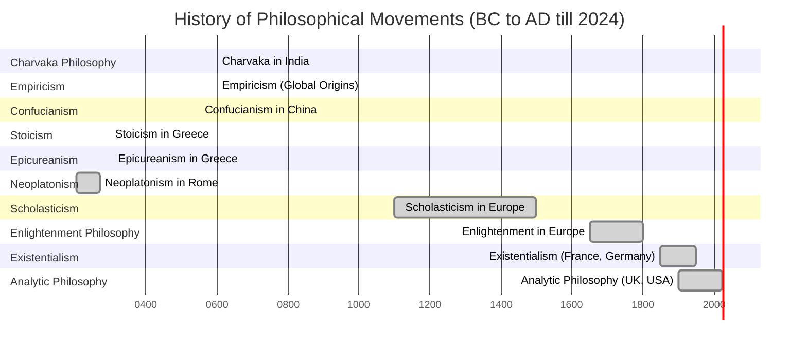

Happiness, is worse than Grief, because to achieve Happiness you have to from deep griefs. and on top of the you will get happiness that's another doubtful question.  

happiness comes with three level grief, Getting, Maintenance, and loosing.  

### Books
- 20 case of suggestive reincarnation.
- Where reincarnation and biology intersect. 
- Indian Philosophy
	- [Bharatiya Darshan ki Rooprekha : Harendra Prasad Sinha](https://www.amazon.in/-/hi/Harendra-Prasad-Sinha/dp/8120821440)
	- [A critical survey of indian philosophy by Chandradhar Sharma](https://www.amazon.in/s/ref=dp_byline_sr_book_1?ie=UTF8&field-author=Chandradhar+Sharma&search-alias=stripbooks). 

Parapsychology branch in science dedicated for reincarnation or resurrection. 

Types of Philosophy

- **empiricism**
	- Ankhon Dekhi Movie based out on it.
- **Charvaka** 
	- Empathized materialism and rejected the Supernatural Powers.

