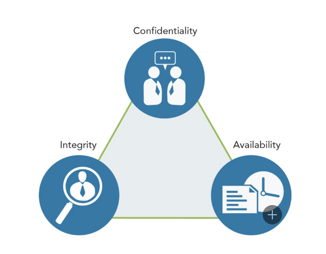
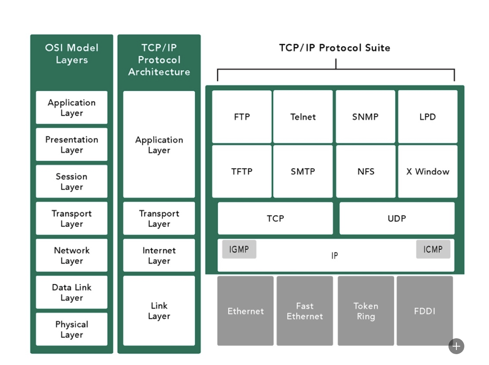

## Chapter 1

**Security Principal**

The CIA Triad (Confidentiality, Integrity, and Availability) defines the core principles of security.

Confidentiality: Protecting information from improper disclosure while allowing authorized access.
Integrity: Ensuring completeness, accuracy, and consistency of information and systems.
Availability: Timely and reliable access to data and information services for authorized users.
Confidentiality:

Involves regulating access to information and protecting it from unauthorized disclosure.
Personally identifiable information (PI), protected health information (PHI), and sensitive information require confidentiality.
Integrity:

Focuses on maintaining the accuracy, consistency, and completeness of data and systems.
Data integrity ensures protection against unauthorized modification, errors, or loss.
Internal consistency ensures information is correct across all related systems.
Availability:

Provides timely and reliable access to data and information services.
Critical systems must be identified and made available according to business requirements.
Availability is related to the concept of criticality, reflecting the importance of data or systems in achieving an organization's goals.
Authentication:

Validates the identity of users.
Common methods include knowledge-based (passwords), token-based (smart cards), and characteristic-based (biometrics).
Multifactor authentication (MFA) involving multiple methods is considered more secure.
Non-repudiation:

Ensures individuals cannot falsely deny their actions.
Provides evidence of who performed specific actions, such as creating, approving, or sending/receiving information.
Privacy and Data Protection:

Privacy involves an individual's right to control the distribution of their information.
Privacy laws and regulations, such as the EU's GDPR, impact organizations' handling of personal information.
Compliance with privacy regulations is essential to avoid penalties and protect sensitive data.

### Risk Management Process

1. Risk Identification: This step involves identifying and documenting potential risks that may impact an organization's operations, assets, or individuals. It requires a thorough examination of the organization's systems, processes, and external factors. Examples of risk identification include:
   - Identifying the risk of a data breach due to weak passwords and lack of user access controls.
   - Identifying the risk of a natural disaster, such as an earthquake or flood, damaging critical infrastructure.
   - Identifying the risk of a supply chain disruption impacting product delivery.
2. Risk Assessment: In this step, identified risks are analyzed and evaluated to understand their likelihood of occurrence and potential impact. Risk assessment helps prioritize risks based on their significance and guides decision-making. Examples of risk assessment include:
   - Assessing the likelihood and impact of a cyberattack on the organization's network infrastructure.
   - Assessing the risk associated with employee negligence or unintentional data leaks.
   - Assessing the potential impact of regulatory non-compliance on the organization's reputation and financial standing.
3. Risk Treatment: Once risks are assessed, organizations need to determine the appropriate response strategies to address them. There are several risk treatment options:
   - Risk Acceptance: If the likelihood or impact of a risk is low and the cost of mitigation outweighs the potential loss, the organization may choose to accept the risk. For example, accepting the risk of a minor office equipment failure that has a low impact on operations.
   - Risk Avoidance: If a risk poses a significant threat or the organization wants to eliminate the risk entirely, it may choose to avoid it. For instance, avoiding the risk of data breaches by not storing sensitive customer information.
   - Risk Mitigation: This involves implementing measures to reduce the likelihood or impact of a risk. Examples include implementing firewalls and intrusion detection systems to mitigate the risk of unauthorized access to a network or conducting regular backups to mitigate the risk of data loss.
   - Risk Transfer: Organizations can transfer risk to another party, typically through insurance policies or outsourcing certain functions. For instance, transferring the risk of property damage due to natural disasters to an insurance company.

4. Risk Monitoring and Review: Risk management is an ongoing process that requires continuous monitoring and review of the effectiveness of risk mitigation measures. This step involves regular assessments, updates to risk profiles, and adjusting risk treatment strategies as needed. Examples of risk monitoring and review include:
   - Regularly reviewing security logs and conducting vulnerability assessments to identify new risks and vulnerabilities.
   - Monitoring industry trends and emerging threats to proactively address potential risks.
   - Conducting periodic audits to assess compliance with security policies and regulations.

### Security Control

Security controls are mechanisms implemented to protect the confidentiality, integrity, and availability of an information system. They can be classified into three categories: physical controls, technical controls, and administrative controls. Here are brief explanations and examples of each:

1. Physical Controls:
   - Physical controls address security needs using physical hardware devices and actions taken by users.
   - Examples include badge readers, locks, security cameras, and access control systems.
   - For instance, visitors entering a workplace must pass through a designated entrance where they are identified and assessed before being allowed entry. Employees may use company-issued badges to assert their identity and gain access.
2. Technical Controls:
   - Technical controls are security measures implemented within computer systems and networks.
   - They provide automated protection, detect security violations, and support security requirements for applications and data.
   - Examples include firewalls, encryption, intrusion detection systems, and antivirus software.
   - For example, configuring firewalls to filter network traffic and allow only authorized connections.
3. Administrative Controls:
   - Administrative controls are directives, guidelines, and policies that govern human behavior within an organization.
   - They cover the entire scope of activities and interactions with external parties.
   - Examples include security awareness training, policies and procedures, and access management processes.
   - An example is the Human Resources department implementing onboarding procedures that ensure employees receive security training, understand acceptable resource usage, and have appropriate access based on their roles.

Administrative controls, when effectively implemented, can be powerful tools for achieving information and system security. They integrate security into business processes and ensure compliance with policies and guidelines.

It's important to note that security controls often work together in a layered approach to provide comprehensive protection against various threats and risks. Organizations should assess their specific security requirements and implement a combination of physical, technical, and administrative controls to mitigate risks and protect their information systems.

### Governance Elements and Processes

- Governance elements: Decisions, rules, practices, policies, and procedures are essential for organizations to achieve their objectives and mission.
- Relationship among governance elements:
  - Procedures: Detailed steps that support policies and guide the completion of tasks.
  - Policies: Established by organizational governance to ensure compliance with industry standards, regulations, and laws.
  - Standards: Frameworks used by governance teams to introduce policies and procedures aligned with regulations and best practices.
  - Regulations: Laws imposed by governments that carry penalties for noncompliance.
- Regulations and Laws:
  - Examples:
    - HIPAA (Health Insurance Portability and Accountability Act): Governs the use of protected health information (PHI) in the United States, with fines and imprisonment as possible penalties for violations.
    - GDPR (General Data Protection Regulation): Controls the use of personally identifiable information (PII) and applies to organizations conducting business with the European Union, imposing financial penalties for mishandling EU citizens' data.
- Standards:
  - Examples:
    - ISO (International Organization for Standardization): Develops international standards, including information systems security, information security, and encryption standards.
    - NIST (National Institute of Standards and Technology): Publishes technical standards, including information technology and information security standards, considered best practices worldwide.
- Policies:
  - Policies provide guidance and context, establish strategic direction and priorities, moderate decision-making, and ensure compliance.
  - Policies are written at various levels within an organization, including high-level governance policies, functional area policies (e.g., HR, finance, security), and specific policies for compliance.
- Procedures:
  - Procedures define explicit and repeatable activities needed to accomplish specific tasks.
  - They provide supporting data, decision criteria, and knowledge required for task execution.
  - Procedures establish measurement criteria and methods to assess task completion.
  - Proper documentation and training on procedures are essential for deriving organizational benefits.

### Summary

In this chapter, you learned about various security principles and concepts related to information assurance. The CIA Triad, consisting of confidentiality, integrity, and availability, was highlighted as the primary component of information assurance.

- Confidentiality (C): It emphasizes the need to protect data from unauthorized access.
- Integrity (I): It focuses on ensuring that data remains unaltered and trustworthy.
- Availability (A): It emphasizes making data accessible to authorized users when and where needed.

Privacy, authentication, non-repudiation, and authorization were also discussed as important aspects of information security.

You explored the importance of risk management in assessing and prioritizing risks to an organization's assets. The options for addressing risks were presented as accept, avoid, mitigate, or transfer.

The chapter introduced three types of security controls:

1. Physical controls: These involve hardware devices, architectural features, and security actions to address process-based security needs.
2. Technical controls: Also known as logical controls, these are implemented by computer systems and networks.
3. Administrative controls: These include directives, guidelines, and advisories that shape the behavior of people within the organization.

Organizational security roles, governance, policies, procedures, and standards were discussed, highlighting the relationship between them. Regulations, typically issued as laws by governments, carry financial penalties for noncompliance. Standards serve as frameworks for introducing policies and procedures that support regulations. Policies, set by organizational governance, provide guidance to ensure compliance with industry standards and regulations. Procedures are the detailed steps that support policies and guide the completion of tasks.

The chapter also covered the ISC2 Code of Ethics, which outlines ethical standards for cybersecurity professionals.

In summary, the chapter emphasized the importance of adhering to legal and ethical standards in the field of cybersecurity.

### Terms and Definations

| Term                                | Definition                                                                                                                                                         | Example                                                                                                                                                   |
| ----------------------------------- | ------------------------------------------------------------------------------------------------------------------------------------------------------------------ | --------------------------------------------------------------------------------------------------------------------------------------------------------- |
| Adequate Security                   | The level of protection and safeguards implemented to ensure the confidentiality, integrity, and availability of information or assets.                            | Implementing firewalls, access controls, and encryption to protect sensitive data from unauthorized access.                                               |
| Administrative Controls             | Policies, procedures, guidelines, and directives implemented by an organization to manage and govern its security practices.                                       | Implementing an information security policy, conducting security awareness training, and establishing incident response procedures.                       |
| Artificial Intelligence             | The development and deployment of computer systems and algorithms that can perform tasks typically requiring human intelligence.                                   | Using machine learning algorithms to analyze large datasets and detect patterns in network traffic to identify potential security threats.                |
| Asset                               | A valuable resource, item, or component that has value to an individual, organization, or system.                                                                  | Computer systems, software applications, customer databases, intellectual property, and financial resources.                                              |
| Authentication                      | The process of verifying the identity of an individual, system, or entity to ensure that they are who they claim to be.                                            | Providing a username and password to log into a secure system or using a fingerprint scanner to unlock a smartphone.                                      |
| Authorization                       | The process of granting or denying access to specific resources, systems, or information based on the authenticated identity and assigned privileges.              | Allowing an employee with administrative privileges to access and modify sensitive files on a server, while restricting access to regular users.          |
| Availability                        | The property of a system or resource being accessible and usable when needed by authorized users.                                                                  | Ensuring that a critical business application is available 24/7 without any interruptions or downtime.                                                    |
| Baseline                            | A standard or reference point against which the security of a system or component is measured or compared.                                                         | Establishing a baseline configuration for a computer system by documenting the approved software versions, security settings, and network configurations. |
| Biometric                           | Biological characteristics or behavioral traits unique to an individual that can be used for authentication purposes.                                              | Fingerprint scans, iris recognition, and facial recognition technologies used for unlocking smartphones or accessing secure facilities.                   |
| Bot                                 | A software application or script that performs automated tasks on the internet, often without the user's knowledge or consent.                                     | Malicious bots used in distributed denial-of-service (DDoS) attacks to overwhelm a target website with traffic and make it inaccessible.                  |
| Classified or Sensitive Information | Information that is labeled or designated as confidential, restricted, or requiring special protection due to its sensitive nature.                                | Government documents marked as "Top Secret" or a company's financial records containing sensitive customer information.                                   |
| Confidentiality                     | The property of data or information being protected from unauthorized disclosure or access.                                                                        | Encrypting sensitive email communications to ensure that only the intended recipients can read the content.                                               |
| Criticality                         | The importance or significance of a system, asset, or process to the organization's operations, goals, or objectives.                                              | A server hosting a critical financial application that is essential for conducting daily transactions and generating revenue.                             |
| Data Integrity                      | The accuracy, completeness, and reliability of data throughout its lifecycle, ensuring that it is not modified or altered in an unauthorized or unintended manner. | Implementing checksums or digital signatures to verify                                                                                                    |

## Chapter 2

### Incident Response

- Incident response is a crucial role of security professionals as they act as first responders when things go wrong in terms of cyberattacks or security incidents.
- Key terms related to incident response include breach, event, exploit, incident, intrusion, threat, vulnerability, and zero day.
  - Breach: A breach refers to the loss of control or compromise of sensitive information. For example, if a hacker gains unauthorized access to a company's database containing customer information and steals personal data such as names, addresses, and credit card details, it would be considered a breach.
  - Event: An event refers to any observable occurrence in a network or system. It could be an anomaly, suspicious activity, or an indicator of a potential security incident. For instance, detecting a large number of failed login attempts or unusual network traffic patterns can be considered events that require investigation.
  - Exploit: An exploit is a specific attack that takes advantage of vulnerabilities in a system. For example, a hacker may use a known software vulnerability to deliver malware or gain unauthorized access to a system.
  - Incident: An incident is an event that actually or potentially jeopardizes the confidentiality, integrity, or availability of an information system or its data. An incident can range from a minor security issue to a significant cyberattack. For instance, if a company's website is defaced by hackers or if a malware infection disrupts critical business operations, it would be considered an incident.
  - Intrusion: Intrusion refers to a deliberate security incident in which an unauthorized individual gains or attempts to gain access to a system or resource. An example of an intrusion is when an attacker bypasses network defenses and gains unauthorized access to sensitive data by exploiting a vulnerability in a web application.
  - Threat: A threat refers to any circumstance or event that has the potential to harm organizational operations, assets, or individuals through unauthorized access, disclosure, modification, or denial of service. For instance, a threat could be a phishing email campaign that attempts to trick employees into revealing their login credentials.
  - Vulnerability: A vulnerability is a weakness in an information system, its security procedures, controls, or implementation that could be exploited by a threat actor. For example, an unpatched software vulnerability or weak password policies can create vulnerabilities that attackers can exploit to gain unauthorized access.
  - Zero Day: A zero-day vulnerability is a previously unknown vulnerability that is exploited by attackers before a patch or fix is available. Since the vulnerability is unknown, it can be exploited without detection or prevention. An example of a zero-day exploit is when a hacker discovers and exploits a vulnerability in a widely used software program before the software vendor becomes aware of it and releases a patch.
- The primary goal of incident response is to protect life, health, and safety, prioritizing the safety of people in all decision-making processes.
- Incident response planning is a subset of business continuity management, which aims to reduce the impact of an incident and resume operations as soon as possible.
- Components of an incident response plan include preparation, detection and analysis, containment, post-incident activity, and retrospective evaluation.
- **Preparation** involves developing a policy, identifying critical data and systems, training staff, forming an incident response team, and practicing incident identification and coordination of communication.
- **Detection and analysis** require monitoring attack vectors, analyzing incidents using known data and threat intelligence, prioritizing incident response, and standardizing incident documentation.
- **Containment** involves gathering evidence, choosing an appropriate containment strategy, identifying the source of the event, and isolating the source.
- **Post-incident** activities include identifying evidence for retention, documenting lessons learned, and complying with regulatory requirements if necessary.

- Consulting with management involves identifying critical information, avoiding single points of failure, training staff in incident response, and coordinating communication with different stakeholders.
- An incident response team is a cross-functional group of individuals who investigate and respond to security incidents, including representatives from senior management, information security, legal, public affairs/communications, and engineering.
- Incident response teams are responsible for investigating incidents, assessing damage, collecting evidence, reporting incidents, initiating recovery procedures, participating in remediation and lessons learned stages, and conducting root cause analysis.
- Dedicated incident response teams, such as computer incident response teams (CIRTs) or computer security incident response teams (CSIRTs), are common in organizations and have primary responsibilities to determine the damage, assess data compromise, implement recovery procedures, and improve security measures to prevent recurrence.

### Bussiness Continuity

The importance of business continuity cannot be overstated. Here are some key points and examples that highlight its significance:

1. Sustaining Operations: Business continuity plans are essential for organizations to continue their critical operations and minimize the impact of disruptions. For instance, in the event of a natural disaster such as a hurricane or earthquake, a business continuity plan ensures that key business functions can be carried out at alternate locations or through remote work arrangements. This enables the organization to maintain its services, meet customer needs, and minimize financial losses.

2. Communication and Coordination: Effective communication is a crucial aspect of business continuity. Establishing multiple contact methodologies and backup numbers ensures that key personnel can be reached during a disruption, even if regular communication channels are compromised. A phone tree, which outlines a hierarchical calling sequence, helps ensure that the right individuals are contacted promptly. This enables efficient coordination and decision-making during an incident.

3. Procedures and Checklists: Business continuity plans should include well-defined procedures and comprehensive checklists to guide personnel during a disruption. Similar to pilots going through a pre-flight checklist, organizations must have established procedures and checklists to ensure that critical elements of business continuity are not overlooked. These procedures and checklists help maintain consistency and ensure that all necessary actions are taken to recover operations.

4. Adaptability and Management Involvement: Business continuity plans should be flexible and adaptable to different scenarios. Management must be involved in the planning process to address changing priorities and make crucial decisions during a disruption. This ensures that the plan can be adjusted as per the specific situation and that the organization can respond effectively to unexpected challenges.

5. External Communication and Support: Business continuity plans should include contact numbers for critical stakeholders outside the organization, such as suppliers, customers, law enforcement, and emergency response agencies. These contacts are essential for coordinating efforts, obtaining assistance, and maintaining essential activities during a major disruption. For example, in the case of a severe cyberattack impacting communication systems, having access to alternative networks or military-grade networks can help hospitals or other critical infrastructures maintain essential operations.

6. Focus on Critical Functions: Business continuity planning focuses on ensuring the continuity of critical products and services provided by the organization. It may involve operating at a reduced capacity but ensures that key functions can continue until normal business operations can be restored. Identifying and prioritizing critical areas through business impact analysis helps allocate resources effectively and ensures that the most essential aspects of the business are protected.

7. Organizational Commitment: Developing and implementing a business continuity plan requires a significant commitment of personnel and financial resources. Executive management or an executive sponsor must provide support and champion business continuity planning efforts. Without proper support and commitment from the organization's leadership, business continuity planning is unlikely to succeed.

Business continuity planning encompasses various components, such as the business continuity plan team, immediate response procedures, notification systems, management guidance, contact numbers, and more. These components work together to create a comprehensive plan that addresses all systems, processes, and operations necessary for maintaining critical business functions.

It is crucial to store the business continuity plan in a location accessible to key personnel. While digital storage is common, having a hard copy, often referred to as the Red Book, can serve as a backup in case electronic systems are unavailable. Regular updates and consistency between electronic and hard copies are essential to ensure accuracy and relevance.

In a real-life scenario, if a company's billing department experiences a complete loss due to a fire, a business continuity plan can help mitigate the impact. The plan may involve relocating the billing department to an alternative site within a week, with customer service staff temporarily handling billing inquiries. This ensures that billing processes continue, customer needs are addressed, and business operations remain uninterrupted.

Overall, business continuity planning is crucial for organizations to be resilient in the face of disruptions, protect their reputation.

### Disaster Recovery

In order to identify the components of disaster recovery, let's break down the information provided in the text:

1. Goal of Disaster Recovery: The goal of disaster recovery is to restore the information technology (IT) and communication services and systems needed by an organization during a disruption and during the restoration of normal services. While business continuity planning focuses on maintaining critical business functions, disaster recovery planning specifically deals with restoring IT and communication systems.

2. Examples of Disaster Recovery: The text provides two examples to illustrate the importance of disaster recovery planning:

   a. **Hospital Compromise**: In a hospital in Los Angeles, a compromise went undetected for 260 days. The hospital couldn't rely on the last backup because it was infected with time-based malware that would corrupt the system upon restoration. To recover, the hospital had to go back nearly a year to restore the entire system and then restore the remaining data piece-by-piece to prevent reinfection. This example emphasizes the need for multiple levels of backups and different retention periods to address organization-specific needs.

   b. **Complex System Dependencies**: The text highlights the importance of understanding the flow of data and dependencies between systems. For example, in another hospital scenario, the radiology department used a different system than the laboratory. Separate routines copied patient data from the registration system to the laboratory and radiology systems, which technically use separate databases. It's crucial to document and implement a disaster recovery plan that considers the intricate dependencies between systems.

3. Components of a Disaster Recovery Plan: The text suggests several types of documents that organizations should consider when developing a disaster recovery plan:

   a. **Executive Summary**: Provides a high-level overview of the plan.

   b. **Department-Specific Plans**: Tailored plans for different departments within the organization.

   c. **Technical Guides**: Detailed guides for IT personnel responsible for implementing and maintaining critical backup systems.

   d. Full Copies of the Plan: Distributed to critical disaster recovery team members.

   e. Checklists: Provided to individuals involved in the recovery efforts, such as the disaster recovery team members, IT personnel, managers, and public relations personnel. Checklists help guide their actions, facilitate effective communication, and ensure necessary steps are taken during the recovery process.

4. Work Lost during the Incident: The text includes a timeline illustration demonstrating the potential work lost during an incident. It shows different events, backups, and transactions along the timeline, indicating the level of integrity, authenticity, and security of the data. The timeline distinguishes work that was fully processed prior to the incident, work that may be compromised or in doubt, and work lost since the incident occurred.

Overall, disaster recovery planning involves identifying critical systems, maintaining backups, understanding system dependencies, and developing comprehensive plans and documentation. By having a well-designed disaster recovery plan in place, organizations can minimize downtime, recover critical systems effectively, and mitigate the impact of disruptions on their operations.

### Summary

Certainly! Here are the key points from this chapter:

1. Incident response plans are designed to keep the business operating during abnormal conditions. They consist of preparation, detection and analysis, containment, eradication and recovery, and post-incident activities.
2. Incident response teams comprise cross-functional members responsible for managing and resolving security incidents.
3. Business continuity plans focus on sustaining business operations during a crisis. They include the steps to enact the plan, notification systems, call trees, and contact information for key stakeholders.
4. Business continuity plans provide immediate response procedures, checklists, and guidance for management.
5. Disaster recovery plans are activated when incident response and business continuity plans fail. They aim to restore operations to normal as quickly as possible.
6. Components of a disaster recovery plan may include an executive summary, department-specific plans, technical guides for IT personnel, full copies of the plan for critical team members, and checklists for specific individuals.
7. Incident response, business continuity, and disaster recovery plans work together to ensure the availability of critical systems and minimize the impact of disruptions.
8. These plans require cross-functional collaboration, training, and regular testing to ensure their effectiveness.
9. The incident response team assesses the extent of damage, implements recovery procedures, and improves security measures to prevent future incidents.
10. Business continuity plans include contact information for third-party partners, vendors, customers, and external emergency providers.
11. The ultimate goal of these plans is to maintain business operations and minimize downtime during and after incidents, crises, or disasters.

By implementing these plans, organizations can effectively respond to incidents, maintain operations, and recover from disruptions, ensuring the continuity and resilience of their business.

### Terms and Definations

| Term                       | Definition                                                                       | Example                                                        |
| -------------------------- | -------------------------------------------------------------------------------- | -------------------------------------------------------------- |
| Adverse Events             | Unfavorable incidents or occurrences                                             | Power outage, natural disaster, cyber-attack                   |
| Breach                     | Unauthorized access or disclosure of sensitive information                       | Data breach resulting in customer data being compromised       |
| Business Continuity        | Ability to maintain essential functions during a crisis                          | Implementing remote work arrangements during a pandemic        |
| Business Continuity Plan   | Documented procedures to ensure business continuity                              | Detailed instructions for employees during a disruptive event  |
| Business Impact Analysis   | Assessment of the potential effects of a disruption                              | Identifying critical systems and their impact on operations    |
| Disaster Recovery          | Restoration of IT and communication services                                     | Recovering servers and databases after a hardware failure      |
| Disaster Recovery Plan     | Strategies and procedures to recover from a disaster                             | Backup and recovery processes for critical systems             |
| Event                      | Occurrence that may disrupt operations                                           | System outage, equipment failure                               |
| Exploit                    | Taking advantage of vulnerabilities to gain unauthorized access                  | Utilizing a software vulnerability to hack into a system       |
| Incident                   | Security event that violates policies or threatens security                      | Unauthorized access attempt or malware infection               |
| Incident Handling          | Process of responding to and managing security incidents                         | Identifying, containing, and resolving a data breach           |
| Incident Response          | Immediate actions taken in response to a security incident                       | Blocking a suspicious IP address after a hacking attempt       |
| Incident Response Plan     | Documented procedures for responding to security incidents                       | Contacting the incident response team and escalating the issue |
| Intrusion                  | Unauthorized access or presence in a system or network                           | Hacking into a company's server without permission             |
| Security Operations Center | Centralized team responsible for monitoring and responding to security incidents | Monitoring network traffic for potential threats               |
| Threat                     | Potential event or action that can exploit vulnerabilities                       | Malware, phishing attacks, social engineering                  |
| Vulnerability              | Weakness or flaw in a system's security defenses                                 | Unpatched software vulnerability that allows remote access     |
| Zero Day                   | Previously unknown software vulnerability                                        | Exploiting a newly discovered flaw before it is patched        |

## Chapter 3

### Access Control Concepts

1. Subjects:

   - A user requesting access to a computer system.
   - A client accessing a web application.
   - A process running on a server.
   - A program requesting data from a database.

2. Objects:

   - A computer system that holds sensitive information.
   - A file or document stored on a server.
   - A database containing customer records.
   - A printer or scanner connected to a network.

3. Rules:

   - Firewall access control list: A rule that allows access from the inside network to the outside network.
   - File access rule: A rule that defines which users have read, write, or delete permissions for a specific file.
   - Time-based access rule: A rule that restricts access to a resource during specific hours of the day.
   - Identity verification rule: A rule that compares the validated identity of a subject to an access control list before granting access.

4. Defense in Depth:

   - Multifactor authentication (MA): Requiring a username, password, and a code sent to a phone for login.
   - Firewall segregation: Using multiple firewalls to separate untrusted networks from trusted networks with sensitive data.
   - Physical security layers: Restricting building access, server room access, and network access using access control measures.

   

5. Principle of Least Privilege:

   - User access permissions: Granting employees access only to the systems and applications necessary to perform their job duties.
   - Privilege escalation: Using the "sudo" command in Linux to temporarily assume higher privileges for specific activities.

6. Privileged Access Management:

   - Just-in-time privileged access: Granting specific subsets of privileges to an identity in real-time when needed.
   - Limiting administrative privileges: Allowing administrators to perform privileged actions only when necessary, reducing the risk of ransomware attacks.

7. Segregation of Duties:

   - Invoice approval process: Requiring a manager's approval before payment can be made.
   - System configuration change: Requiring technical and management review and approval before implementing proposed changes.

8. Two-Person Integrity:

   - High-security area access: Requiring at least two individuals to be present to enter a restricted area.
   - Life safety measures: Ensuring there is always someone available to assist in case of emergencies within secure areas.

9. Authorized Versus Unauthorized Personnel:

   - ID badge access control: Allowing access to a data center only for individuals with authorized ID badges.
   - File system permissions: Granting read, write, and delete permissions to authorized users while denying access to unauthorized users.

10. User Provisioning:
    - New employee onboarding: Security administrator creating a new user ID for a newly hired employee.
    - Privilege changes: Modifying user privileges based on changes in job roles or responsibilities.

### Physical access controls

Physical Security Controls:

- Physical access controls are tangible items used to prevent, monitor, or detect direct contact with systems or areas within a facility.
- Examples of physical access controls: security guards, fences, motion detectors, locked doors or gates, sealed windows, lights, cable protection, laptop locks, badges, swipe cards, guard dogs, cameras, mantraps, turnstiles, alarms.

Types of Physical Security Controls:

1. Badge Systems and Gate Entry:

   - Turnstiles, mantraps, and remotely/system-controlled door locks are used for human traffic control.
   - Access control system with enrollment station assigns and activates an access control device (e.g., badge).
   - Different card types: bar code, magnetic stripe, proximity, smart, hybrid.

2. Environmental Design:

   - Crime Prevention through Environmental Design (CPTED) aims to create safer workspaces through passive design elements.
   - It includes factors like building construction standards, data center design, and circulation flow to enhance physical security.

   

3. Biometrics:
   - Biometric authentication uses unique individual characteristics for identity verification.
   - Physiological biometrics: fingerprints, iris scan, retinal scan, palm scan, venous scan.
   - Behavioral biometrics: voiceprints, signature dynamics, keystroke dynamics.

Monitoring:

- Physical access controls and monitoring personnel and equipment entering/leaving, and auditing/logging all physical events are vital for overall security.

Monitoring Examples:

1. Security Guards:

   - Security guards deter unauthorized access and prevent theft or abuse of equipment or information.

2. Cameras:

   - Cameras provide surveillance and monitoring, acting as a deterrent and providing evidence if combined with other sensors.

3. Alarm Systems:

   - Door/window alarms notify personnel when opened unexpectedly.
   - Fire alarms activate in response to heat or smoke, alerting people nearby and local response personnel.
   - Panic buttons activate alerts to police or security personnel.

4. Logs:
   - Physical logs, such as sign-in sheets or electronic access control logs, are important for legal compliance and forensic investigations.
   - Regular log reviews and proper log retention guidelines are necessary.
   - Log anomalies help identify security-related issues, such as gaps in timestamps or account lockouts.

Note: Business and legal requirements for log retention may vary, and it's important to consult the legal department for specific guidelines.

### Logical Access Controls

| Discretionary Access Control (DAC) | Description                                                                                                                                                                                                                                                                        |
| ---------------------------------- | ---------------------------------------------------------------------------------------------------------------------------------------------------------------------------------------------------------------------------------------------------------------------------------- |
| Definition                         | Access control method enforced over all subjects and objects in an information system.                                                                                                                                                                                             |
| Permissions and Actions            | Subjects can pass information to other subjects/objects, grant privileges, change security attributes, choose attributes for new/revised objects, and change access control rules.                                                                                                 |
| Example Scenario                   | Users (Steve and Aidan) in a UNIX environment can establish/change permissions on files they create/own. Access control is determined by the discretion of the object owner.                                                                                                       |
| Example                            | Chmod, Setuid                                                                                                                                                                                                                                                                      |
| Mandatory Access Control (MAC)     | Description                                                                                                                                                                                                                                                                        |
| ------------------------------     | ------------------------------------------------------------                                                                                                                                                                                                                       |
| Definition                         | Access control method uniformly enforced across all subjects and objects within an information system.                                                                                                                                                                             |
| Access Control Actions             | Only designated security administrators can modify security rules. Subjects are constrained from passing information to unauthorized entities, granting privileges, changing security attributes, choosing attributes for new/modified objects, and changing access control rules. |
| Example Scenario                   | Security administrators assign access rights/permissions to subjects and objects within the system, and subjects cannot control access themselves.                                                                                                                                 |
| Example                            | SeLinux (object is labeled with a security context)                                                                                                                                                                                                                                |

| Role-based Access Control (RBAC) | Description                                                                                                                                                                                                                                                   |
| -------------------------------- | ------------------------------------------------------------------------------------------------------------------------------------------------------------------------------------------------------------------------------------------------------------- |
| Definition                       | User permissions are based on predefined roles.                                                                                                                                                                                                               |
| Role Assignment                  | Roles are created and assigned appropriate access privileges. Users are assigned to roles based on their job responsibilities.                                                                                                                                |
| Access Management                | When a user takes on a job, they are assigned to the relevant role. If a user leaves the role, their access associated with that role is removed. Suitable for environments with high staff turnover and multiple personnel with similar access requirements. |
| Example                          | Linux Kernel (Linux PAM (Pluggable Authentication Modules) framework)                                                                                                                                                                                         |

### Summary

- Access is based on three elements: subjects, objects, and rules. Trustworthiness and the need for access help determine access.
- Defense in depth is an information security strategy that establishes variable barriers across multiple layers and missions of an organization.
- The Principle of Least Privilege emphasizes that users should have the minimum access necessary to perform their job.
- Privileged Access Management reduces risk by limiting administrative privileges to when they are needed and ensuring authorized access during approved activities.
- Segregation of duties and two-person integrity help reduce insider threats, and user provisioning manages user identities from hire to termination.
- Physical access controls include security measures such as guards, fences, locks, alarms, and mantraps/turnstiles.
- Logical access controls, also known as technical controls, can be software or hardware-based and manage access through settings or parameters.
- Discretionary Access Control (DAC) is an access control policy enforced over all subjects and objects in an information system.
- Mandatory Access Control (MAC) enforces a uniform access control policy across all subjects and objects within an information system.
- Role-based Access Control (RBAC) sets up user permissions based on roles, simplifying access management.

### Terms and Definations

Here is the information arranged in a table format:

| Term                                                  | Definition                                                                                                                                                                         |
| ----------------------------------------------------- | ---------------------------------------------------------------------------------------------------------------------------------------------------------------------------------- |
| Audit                                                 | Independent review and examination of records and activities to assess the adequacy of system controls, to ensure compliance with established policies and operational procedures. |
| Crime Prevention through Environmental Design (CPTED) | An architectural approach to the design of buildings and spaces which emphasizes passive features to reduce the likelihood of criminal activity.                                   |
| Defense in Depth                                      | Information security strategy integrating people, technology, and operations capabilities to establish variable barriers across multiple layers and missions of the organization.  |
| Discretionary Access Control (DAC)                    | A certain amount of access control is left to the discretion of the object's owner, or anyone else who is authorized to control the object's access.                               |
| Encrypt                                               | To protect private information by putting it into a form that can only be read by people who have permission to do so.                                                             |
| Firewalls                                             | Devices that enforce administrative security policies by filtering incoming traffic based on a set of rules.                                                                       |
| Insider Threat                                        | An entity with authorized access that has the potential to harm an information system through destruction, disclosure, modification of data, and/or denial of service.             |
| iOS                                                   | An operating system manufactured by Apple Inc. Used for mobile devices.                                                                                                            |
| Layered Defense                                       | The use of multiple controls arranged in series to provide several consecutive controls to protect an asset; also called defense in depth.                                         |
| Linux                                                 | An operating system that is open source, making its source code legally available to end users.                                                                                    |
| Log Anomaly                                           | A system irregularity that is identified when studying log entries which could represent events of interest for further surveillance.                                              |
| Logging                                               | Collecting and storing user activities in a log, which is a record of the events occurring within an organization's systems and networks.                                          |
| Logical Access Control Systems                        | An automated system that controls an individual's ability to access computer system resources based on validation of their identity and assignment of access privileges.           |
| Mandatory Access Control                              | Access control that requires the system itself to manage access controls in accordance with the organization's security policies.                                                  |
| Mantrap                                               | An entrance to a building or an area that requires people to pass through two doors with only one door opened at a time.                                                           |
| Object                                                | Passive information system-related entity containing or receiving information. Access to an object implies access to the information it contains.                                  |
| Physical Access Controls                              | Controls implemented through tangible mechanisms such as walls, fences, guards, locks, etc., to secure physical spaces and assets.                                                 |
| Principle of Least Privilege                          | The principle that users and programs should have only the minimum privileges necessary to complete their tasks.                                                                   |
| Privileged Account                                    | An information system account with approved authorizations of a privileged user.                                                                                                   |
| Ransomware                                            | A type of malicious software that locks the computer screen or files, thus preventing or limiting a user from accessing their system and data until money is paid.                 |
| Role-based access control (RBAC)                      | An access control system that sets up user permissions based on roles.                                                                                                             |
| Rule                                                  | An instruction developed to allow or deny access to a system by comparing the validated identity of the subject to an access control list.                                         |
| Segregation of Duties                                 | The practice of ensuring that an organizational process cannot be completed by a single person, therefore forces collusion to reduce insider threats.                              |
| Subject                                               | An individual process or device that causes information to flow among objects or change the system state.                                                                          |
| Technical Controls                                    | The security controls (e.g., safeguards or counter                                                                                                                                 |

## Chapter 4

Network Basics

Lots of network basics, like tcp/udp, safeports, ipv4 ipv6 etc etc.

Important to Note:
As in IPv4, there are some addresses and ranges that are reserved for special uses:

• `::1` is the local loopback address, used the same as `127.0.0.1` in IPv4.

• The range 2001:db8.: to 2001:db8ffff.ffff.:ffff:ffff:ffff:ffff is reserved for documentation use,
as in the examples above.

• fc00: to fdffffffffffffffffffffffffff.:ffff are addresses reserved for internal network use and
are not routable on the internet.

### Network (Cyber) Threats and Attacks

There are various types of threats in cybersecurity. Here are some common ones:

1. Malware: Malicious software, including viruses, worms, Trojans, ransomware, spyware, and adware, designed to disrupt, damage, or gain unauthorized access to computer systems.

2. Phishing: An attempt to deceive individuals into revealing sensitive information, such as passwords, credit card numbers, or social security numbers, by disguising as a trustworthy entity in electronic communication.

3. Social Engineering: Manipulating individuals to disclose confidential information or perform actions that can compromise security, often through psychological manipulation and exploiting human vulnerabilities.

4. Denial-of-Service (DoS) Attacks: Overloading a system, network, or website with excessive requests or traffic, causing it to become unavailable to legitimate users.

5. Insider Threats: Security risks posed by individuals within an organization who have authorized access but misuse their privileges or intentionally harm the organization's systems, data, or operations.

6. Advanced Persistent Threats (APTs): Targeted and sophisticated attacks that involve a prolonged intrusion into a network or system, aiming to steal sensitive information or gain control over resources.

7. Zero-day Exploits: Vulnerabilities or weaknesses in software that are unknown to the software vendor and can be exploited by attackers before a patch or fix is developed and released.

8. Data Breaches: Unauthorized access, acquisition, or exposure of sensitive information, such as personal identifiable information (PII) or financial data, often resulting in identity theft, fraud, or reputational damage.

9. Man-in-the-Middle (MitM) Attacks: Interception and alteration of communication between two parties without their knowledge, allowing an attacker to eavesdrop, modify, or inject malicious content into the communication.

10. SQL Injection: Exploiting vulnerabilities in web applications that do not properly validate user input, allowing attackers to manipulate databases and execute unauthorized commands.

**Identifying Threats and tools used to prevent them**

1. **Intrusion Detection System (IDS)**:

   - IDS monitors network traffic or system activities to identify and alert about suspicious or malicious behavior.
   - Example: Snort is an open-source IDS that analyzes network traffic in real-time, detects potential threats, and generates alerts.

2. **Host-based IDS (HIDS)**:

   - HIDS operates on individual hosts or endpoints, monitoring their activities, file integrity, and system logs.
   - Example: OSSEC (Open Source HIDS) monitors log files, detects unauthorized system changes, and alerts administrators.

3. **Network-based IDS (NIDS)**:

   - NIDS analyzes network traffic to detect malicious activity and potential intrusions at the network level.
   - Example: Suricata is an open-source NIDS that inspects network packets, detects threats, and triggers alerts.

4. **SIEM (Security Information and Event Management)**:

   - SIEM tools collect and analyze security event logs from various sources to provide centralized security monitoring, event correlation, and incident response capabilities.
   - Example: Splunk is a popular SIEM platform that aggregates and correlates logs from various sources, enabling security teams to identify and respond to security incidents.

5. **Anti-malware/Antivirus**:

   - Anti-malware or antivirus software detects, blocks, and removes malicious software (malware) from systems.
   - Example: McAfee and Norton are well-known antivirus solutions that scan files, emails, and websites for malware, and quarantine or remove detected threats.

6. **Scans**:

   - Scanning tools perform various types of security scans to identify vulnerabilities, misconfigurations, or weaknesses in systems or networks.
   - Example: Nessus is a widely used vulnerability scanning tool that identifies security issues, such as outdated software versions, weak passwords, or open ports, through automated scans.

7. **Firewall**:

   - Firewalls control and filter network traffic based on predefined rules, allowing or blocking specific connections and protecting against unauthorized access.
   - Example: pfSense is an open-source firewall that inspects incoming and outgoing traffic, applies firewall policies, and enforces network security rules.

8. **Intrusion Protection System (IPS - NIPS/HIPS)**:
   - IPS actively monitors network traffic or system activities and takes proactive measures to block or prevent potential intrusions.
   - Network-based IPS (NIPS): Example - Cisco Firepower IPS inspects network packets, detects threats, and can automatically block malicious traffic.
   - Host-based IPS (HIPS): Example - OSSEC (Open Source HIDS) can function as a HIPS by monitoring and blocking suspicious activities on individual hosts.

Each of these tools plays a specific role in strengthening cybersecurity defenses and protecting against different types of threats. It's common for organizations to use a combination of these tools as part of a comprehensive security strategy to detect, prevent, and respond to security incidents effectively.

### Network security Infrastructure

Memorandum of Understanding (MOU)/Memorandum of Agreement (MOA) - Sharing resource from other company i case of disaster or emergency.

**Cloud Service Models**

| Service Model | Description                                                              | Examples                                               |
| ------------- | ------------------------------------------------------------------------ | ------------------------------------------------------ |
| SaaS          | Provides software applications over the internet.                        | Salesforce, Google Workspace, Dropbox                  |
| PaaS          | Provides a platform for developing, testing, and deploying applications. | Heroku, Microsoft Azure App Service, Google App Engine |
| IaaS          | Provides virtualized computing resources as a service.                   | Amazon EC2, Microsoft Azure VMs, Google Compute Engine |

**Managed Service Provider (MSP):**

- An MSP manages IT assets and functions for another company.
- Small- and medium-sized businesses outsource their IT needs to MSPs for expertise and day-to-day operations.
- MSPs offer services such as network and security monitoring, patching, and help desk support.
- They may provide cloud-based services like managed detection and response (MDR).

**Service-Level Agreement (SLA):**

- An agreement between a cloud service provider and customer that defines the quality of services.
- Specifies measurable properties and requirements for the cloud services.
- Covers availability, security, controls, support, data privacy, disaster recovery, and more.
- Important for setting expectations, outlining remedies for non-compliance, and documenting service parameters.

**Network Design:**

- Network design aims to meet data communication requirements and optimize performance.
- Security considerations include network segmentation, DMZs, VLANs, and VPNs.
- Network segmentation controls traffic between devices and isolates networks.
- DMZs are isolated areas accessed by external visitors for hosting public resources.
- VLANs logically segment networks without changing the physical topology.
- VPNs provide secure communication tunnels over untrusted networks.

**Defense in Depth:**

- Defense in depth is a layered security approach to protect an organization's systems.
- It uses multiple types of access controls across different layers to avoid relying on a single security measure.
- Layers can include data controls, application protection, host security, internal network controls, perimeter security, physical barriers, and policies/procedures.
- Each layer adds a level of protection and deterrence to attackers.
- It involves both technological and administrative controls to minimize risks and empower insiders.

#### Zero Trust

**Zero Trust** is an approach to network security that is particularly relevant and beneficial in cloud environments. In the cloud, where traditional network perimeters are less defined, Zero Trust provides a framework for securing data, applications, and resources. Here's how Zero Trust is implemented in the cloud:

1. Identity-based Access Control: Zero Trust in the cloud revolves around strong identity and access management. It ensures that every user, device, and application is properly authenticated and authorized before accessing resources. This is achieved through techniques such as multi-factor authentication (MFA), identity federation, and fine-grained access controls.

2. Least Privilege: Zero Trust emphasizes the Principle of Least Privilege, which means granting users and systems only the minimum privileges necessary to perform their tasks. This reduces the risk of unauthorized access and limits the potential impact of a security breach.

3. Microsegmentation: Just as in traditional networks, microsegmentation is a key component of Zero Trust in the cloud. It involves dividing the cloud environment into smaller segments and applying access controls and security policies at each segment. This helps contain and isolate potential threats, preventing lateral movement within the network.

4. Continuous Monitoring and Analytics: Zero Trust in the cloud relies on continuous monitoring and analytics to detect anomalies and potential security breaches. This involves analyzing user behavior, network traffic, and other indicators to identify any suspicious activities and take proactive measures.

5. Encryption and Data Protection: Zero Trust emphasizes the use of encryption and data protection techniques to secure data both in transit and at rest. This ensures that even if data is intercepted or compromised, it remains unintelligible to unauthorized parties.

6. Automation and Orchestration: Zero Trust in the cloud leverages automation and orchestration capabilities to enforce security policies consistently across the cloud environment. This helps ensure that security controls are consistently applied and reduces the risk of human error.

7. Auditing and Compliance: Zero Trust in the cloud includes robust auditing and compliance capabilities. It enables organizations to track and monitor user activities, access requests, and system changes, providing an audit trail for forensic analysis and meeting regulatory compliance requirements.

By implementing Zero Trust in the cloud, organizations can significantly enhance their security posture, protect sensitive data, and mitigate the risks associated with cloud computing. It provides a holistic and adaptive security framework that aligns with the dynamic and distributed nature of cloud environments.

#### Network Access Control (NAC)

Network Access Control (NAC) is a security concept and set of technologies that enforce policies and controls for devices attempting to connect to a network. It verifies the identity of devices or users, assesses their security posture, and enforces access privileges based on predefined policies. NAC helps prevent unauthorized or non-compliant devices from accessing the network, improves network visibility and control, and ensures compliance with security standards. It plays a crucial role in securing modern networks, especially in BYOD, IoT, and cloud computing environments.

In Google Cloud Platform (GCP), Network Access Control (NAC) refers to the set of services and features that help organizations secure their cloud infrastructure and control access to resources. Here's a summary of NAC in GCP:

- Virtual Private Cloud (VPC): Allows you to create private networks and define firewall rules to control inbound and outbound traffic within your cloud environment.

- Cloud Identity-Aware Proxy (IAP): Enables secure access to web applications by enforcing access control policies based on user identity, context, and multi-factor authentication.

- Cloud Identity and Access Management (IAM): Centralized access control system for managing user and service account permissions, allowing you to define fine-grained access policies and control resource-level access.

- Cloud Firewall: Stateful firewall service that allows you to define network-level firewall rules to control traffic between your VPC networks and the internet.

- Cloud Armor: DDoS protection and web application firewall service that helps safeguard your cloud applications from malicious traffic and common web attacks.

These services in GCP provide the necessary tools to secure your cloud infrastructure, manage user access, define firewall rules, and protect against security threats. By leveraging these features, organizations can establish effective network access control measures in their GCP environments.

#### Microsegmentation

Microsegmentation is a network security technique that involves dividing a network into smaller segments or microsegments. Each microsegment operates as an isolated and secure zone, with its own set of security policies and controls. By implementing microsegmentation, organizations can enhance their network security and minimize the potential impact of a security breach.

Key characteristics of microsegmentation include:

1. Granular Control: Microsegmentation allows for precise control over network traffic by defining specific security policies for each microsegment. This enables organizations to restrict communication between different segments and enforce strict access controls.

2. Enhanced Security: By implementing security policies at the microsegment level, organizations can prevent lateral movement of threats within their network. Even if a breach occurs in one microsegment, it remains contained, limiting the potential impact on other segments.

3. Zero Trust Approach: Microsegmentation aligns with the zero trust security model, where access to resources is granted on a need-to-know basis and verified continuously. Every communication between microsegments is authenticated and authorized, reducing the attack surface and improving overall security.

4. Application-Aware Protection: Microsegmentation focuses on protecting individual applications and workloads by isolating them into separate segments. This allows for tailored security measures based on the specific requirements and vulnerabilities of each application.

5. Scalability and Flexibility: Microsegmentation can be applied to both on-premises and cloud environments, providing scalability and flexibility as organizations expand their infrastructure. It allows for dynamic segmentation that can adapt to changing network requirements.

By implementing microsegmentation, organizations can enhance their network security posture, improve visibility into network traffic, and minimize the impact of security incidents by containing them within individual segments.

## Chapter 5

#### **Security Operations**

**Data Handling**

All ideas, data, information, or knowledge go through six major phases during their lifetime.
Conceptually, these involve:

• Creation of the knowledge, which was previously undocumented.

• Storing or recording it in some fashion that makes it explicit.

• Using the knowledge, which may cause the information to be modified, supplemented, or
partially deleted.

• Sharing the data with other users-whether as a copy or by moving the data from one
location to another.

• Archiving the data when it is temporarily not needed.

• Destroying the data when it is no longer needed

**Data Handling**

**Data handling** practices are crucial for ensuring the confidentiality, integrity, and availability of data within an organization. This involves classifying and labeling data based on its sensitivity, documenting retention requirements, and properly destroying data that is no longer needed. Here's a breakdown of the key concepts:

1. Classification: Data classification involves assessing the potential impact or loss to the organization if the information is compromised. This includes evaluating its characteristics of confidentiality, integrity, and availability. Classifications are derived from laws, regulations, standards, or business expectations. Examples of classification levels include:

- Highly restricted: Data that, if compromised, could put the organization's future existence at risk and may lead to significant harm, loss of life, or property damage.
- Moderately restricted: Data whose compromise could result in the loss of temporary competitive advantage, revenue, or disruption of planned investments or activities.
- Low sensitivity (internal use only): Data whose compromise may cause minor disruptions, delays, or impacts.
- Unrestricted public data: Data that is already publicly available and can be freely disseminated.

2. Labeling: Security labels are used to assign a level of sensitivity to data assets. The higher the sensitivity level, the greater the presumed harm to the organization, and the more stringent security measures are required. Clear boundaries between classification labels may not always exist, but organizations should aim for a manageable number of classifications (typically two or three).

3. Retention: Data retention refers to the period for which data should be kept, based on industry standards, laws, regulations, or the organization's own policies. Data should only be retained as long as it remains beneficial. Organizations need to maintain an accurate inventory of data assets, including their location, retention period, and destruction requirements. Regular reviews should be conducted to reduce the volume of stored information and ensure that only necessary data is preserved.

4. Destruction: Data destruction is necessary when an asset reaches its retention limit or is no longer needed. Remanence, which is data that remains on media even after deletion, can pose a security risk. Various methods can be employed for data destruction, such as clearing the device by overwriting it with random values, purging to eliminate residual physical effects, or physically destroying the media through shredding, burning, or other means. The choice of method depends on the level of sensitivity and the type of media.

**Logging and Monitoring:**

- Logging is the process of capturing events and activities in a system or network, providing a record of what has occurred.
- Monitoring involves the continuous observation of logs and system activities to detect anomalies, security incidents, and performance issues.
- Effective logging and monitoring practices help identify security breaches, track system usage, and ensure compliance.
- Example: Regular log reviews can detect policy violations, security incidents, and operational problems promptly.

**Event Logging Best Practices**

Different tools are used to log events depending on whether the attack risk is from traffic coming into or leaving
the infrastructure. Ingress monitoring refers to surveillance and assessment of all inbound communications
traffic and access attempts. Devices and tools that offer log and alert opportunities for ingress monitoring
include:

• Firewalls

• Gateways

• Remote authentication servers

• IDS/IPS tools

• SIEM solutions

• Anti-malware solutions

**Egress monitoring** is used to regulate data leaving the organization's IT environment. This is also known as
data loss prevention (DLP) or data leak protection. A DLP solution should be deployed so that it can inspect all
forms of data leaving the organization, including:

• Email (content and attachments)

• Copy to portable media

• File Transfer Protocol (FTP)

• Posting to web pages/websites

• Applications/application programming interfaces (APIs)

**Encryption Overview**

Almost every action taken in the modern digital world involves cryptography. Encryption protects personal and
business transactions; digitally signed software updates verify a creator or supplier's claim to authenticity.
Digitally signed contracts, binding on all parties, are routinely exchanged via email without fear of being
repudiated later by the sender.

Cryptography is used to protect information by keeping its meaning or content secret and making it unintelligible
to someone who does not have a way to decrypt (unlock) that protected information. The objective of every
encryption system is to transform an original set of data, called plaintext, into an otherwise unintelligible
encrypted form, called ciphertext.

Properly used, alone or in combination, cryptographic solutions provide a range of services that can help achieve
required systems security postures in many ways:

• Confidentiality. Cryptography provides confidentiality by hiding or obscuring a message so that it cannot be
understood by anyone except the intended recipient. Confidentiality keeps information secret from those
who are not authorized to have it.

• Integrity. Hash functions and digital signatures can provide integrity services that allow a recipient to
verify a message has not been altered by malice or error. These include simple message integrity controls.
Any changes, deliberate or accidental, will result in the two results (by sender and by recipient) being
different.

**Symmetric encryption and asymmetric encryption:**

|               | Symmetric Encryption                                                                                                                                                                              | Asymmetric Encryption                                                                                                                                                                     |
| ------------- | ------------------------------------------------------------------------------------------------------------------------------------------------------------------------------------------------- | ----------------------------------------------------------------------------------------------------------------------------------------------------------------------------------------- |
| Key Type      | Single shared key                                                                                                                                                                                 | Public key and private key pair                                                                                                                                                           |
| Usage         | Encryption and decryption with the same key                                                                                                                                                       | Encryption with the public key, decryption with the private key                                                                                                                           |
| Key Exchange  | Key must be securely shared between parties                                                                                                                                                       | Public key can be freely distributed                                                                                                                                                      |
| Speed         | Faster and more efficient for large data volumes                                                                                                                                                  | Slower and computationally more expensive                                                                                                                                                 |
| Examples      | AES (Advanced Encryption Standard),                                                                                                                                                               | RSA (Rivest-Shamir-Adleman),                                                                                                                                                              |
|               | DES (Data Encryption Standard),                                                                                                                                                                   | Diffie-Hellman,                                                                                                                                                                           |
|               | 3DES (Triple Data Encryption Standard)                                                                                                                                                            | ECC (Elliptic Curve Cryptography)                                                                                                                                                         |
| Advantages    | - Fast and efficient encryption/decryption processes - Suitable for bulk data encryption - Requires less computational power and resources - Widely supported and implemented algorithms | - Provides secure key exchange - Supports digital signatures and authentication - Enables secure communication without prior key exchange - Supports secure data transmission    |
| Disadvantages | - Requires secure key distribution - Lack of scalability for large networks - Limited key management options - Prone to key compromise due to single key usage                           | - Slower encryption/decryption processes - More computationally expensive - Requires larger key sizes for equivalent security - Limited algorithm options for specific use cases |

**Encryption, Hashing, and Salting**

|               | Encryption                                                                                     | Hashing                                                                                          | Salting                                                                     |
| ------------- | ---------------------------------------------------------------------------------------------- | ------------------------------------------------------------------------------------------------ | --------------------------------------------------------------------------- |
| Purpose       | Protects data by transforming it into a ciphertext that can be reversed using a decryption key | Converts data into a fixed-length hash value that cannot be reversed to obtain the original data | Adds random data (salt) to the input before hashing to enhance security     |
| Usage         | Confidentiality and privacy of data                                                            | Data integrity verification and password storage                                                 | Password storage and protection against precomputed hash attacks            |
| Key/Value     | Encryption key required to encrypt and decrypt data                                            | No key required                                                                                  | Random salt value added to the input data                                   |
| Examples      | AES (Advanced Encryption Standard), RSA (Rivest-Shamir-Adleman)                                | MD5 (Message Digest Algorithm 5), SHA-256 (Secure Hash Algorithm 256-bit)                        | bcrypt, scrypt, PBKDF2                                                      |
| Advantages    | - Provides confidentiality of data - Allows reversible encryption and decryption            | - Provides data integrity verification - Produces a fixed-length hash value                   | - Enhances password security - Protects against precomputed hash attacks |
| Disadvantages | - Requires secure key management and distribution - May introduce computational overhead    | - Hash values cannot be reversed to obtain original data - Vulnerable to hash collisions      | - Requires additional storage for salt values                               |
|               |                                                                                                | - Vulnerable to brute-force attacks                                                              | - Salts may be compromised if not adequately protected                      |
|               |                                                                                                |                                                                                                  | - Requires additional computation for salting and verification              |

It's important to note that while encryption focuses on confidentiality, hashing emphasizes data integrity and salting primarily enhances password security.

#### System hardening

Configuration management involves managing and controlling the configuration of software, hardware, and network infrastructure. It includes maintaining an inventory of IT assets, establishing baselines as reference points, implementing updates and patches to address issues and improve security, and ensuring compliance with regulations. It provides benefits such as stability, security, compliance, efficiency, scalability, and effective change management.

**Best Practice Securoty Policies**

**Data Handling Policy:**

1. Data Classification: Establish a classification system to categorize data based on its sensitivity and define appropriate handling and protection measures for each category.
2. Access Controls: Implement access controls to ensure that data is only accessible to authorized individuals, including user authentication, role-based access, and data encryption where necessary.

**Password Policy:**

1. Complexity Requirements: Set guidelines for creating strong passwords, including minimum length, a combination of alphanumeric and special characters, and regular password updates.
2. Multi-Factor Authentication: Encourage or require the use of multi-factor authentication to add an extra layer of security, such as using a combination of passwords, biometrics, or tokens for authentication.

**Change Management Policy:**

1. Request Process: Establish a formal process for submitting change requests, including necessary documentation and information about the proposed changes.
2. Approval and Rollback Procedures: Define criteria for approving or rejecting change requests, assign responsibility for reviewing and approving changes, and establish procedures for rolling back changes in case of unforeseen issues or negative impacts.

**Bring Your Own Device (BYOD) Policy:**

1. Device Registration and Security: Require employees to register their personal devices used for work purposes, implement security measures such as device encryption and remote wiping capabilities to protect sensitive data.
2. Usage Guidelines: Provide guidelines on acceptable use of personal devices, including restrictions on accessing certain websites, downloading unauthorized apps, or sharing company data outside approved channels.

**Acceptable Use Policy:**

1. Authorized Usage: Specify acceptable use of company resources, such as computers, internet access, and email, ensuring that employees use these resources for work-related purposes only.
2. Prohibited Activities: Outline activities that are strictly prohibited, such as unauthorized access to systems, sharing confidential information, or engaging in illegal or unethical behavior.

#### Security Training

"There is no patch of human stupidity"

**Train the employess**

- Phishing
- Social Engineering
- Password Protection

**Terms and Defination**

| Degaussing | A technique of erasing data on disk or tape (including video tapes) that, when performed properly, ensures that there is insufficient magnetic remanence to reconstruct data. |
| ---------- | ----------------------------------------------------------------------------------------------------------------------------------------------------------------------------- |
