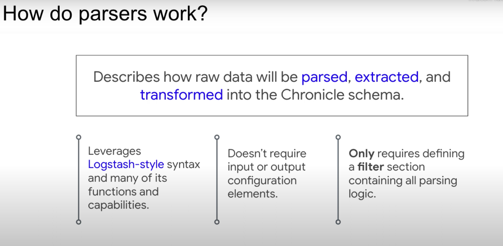
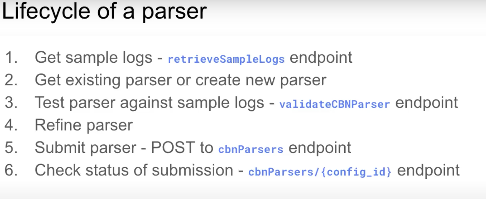
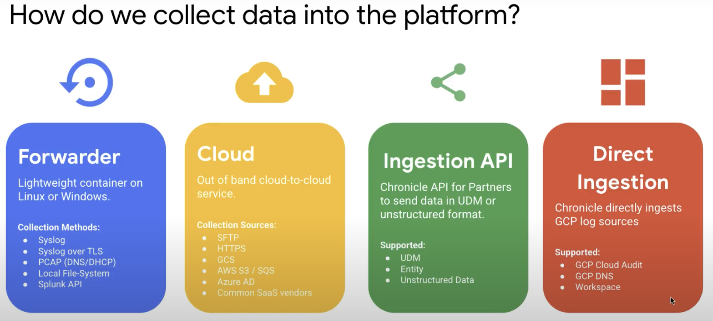
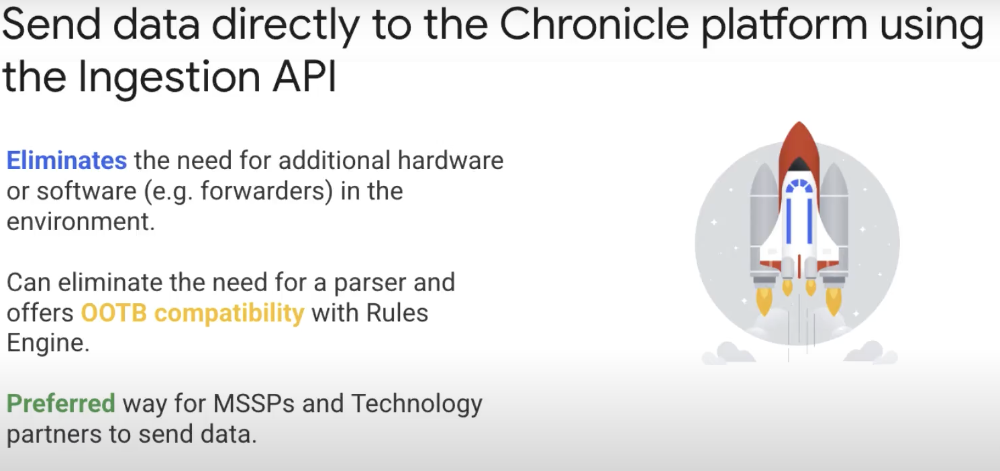
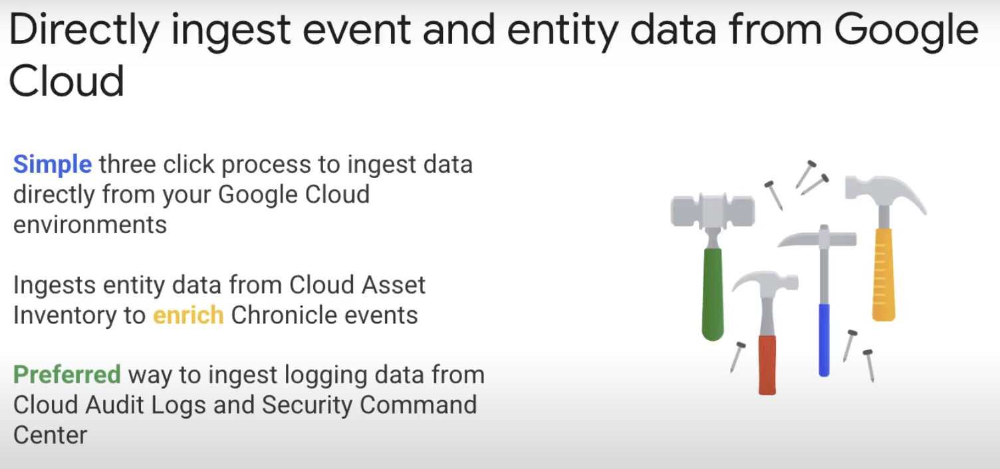

## Fundamentals

<iframe width="100%" height="315" src="https://www.youtube.com/embed/5NjLrnH2LfY" title="YouTube video player" frameborder="0" allow="accelerometer; autoplay; clipboard-write; encrypted-media; gyroscope; picture-in-picture; web-share" allowfullscreen></iframe>

Overview:

- Dave Harold, a Principal Security Strategist at Google Cloud, is providing an overview of the Chronicle Unified Data Model (UDM).
- This will cover the need for normalization in security analytics and how UDM normalization works in Chronicle.


The Need for Normalization:

- Security is a data problem, organizations gather large amounts of security data daily, but there are challenges in using this security telemetry.
- The data is unstructured or multi-structured, and each source can use a different format.
- The field names can vary widely from one data source to another, making it challenging to write alerts or perform analysis.
- Therefore, a common way to represent security data is needed, starting with normalizing field names.

UDM Normalization in Chronicle:

- Chronicle uses UDM to represent security telemetry.
- Parsers within Chronicle convert raw logs into UDM.
- Normalized data is available for detection rules, search, and analytics.
- Normalization simplifies detection rules, avoids search-time field extraction, and allows for shared content repositories.
- UDM supports entity data and relationships for contextual enrichment.
- Chronicle makes normalization easy with a comprehensive structured UDM, an extensive default parser library, and support for custom log formats.

UDM Events:


## What is Chronicle?

<iframe width="100%" height="315" src="https://www.youtube.com/embed/2IK6p6JNYIU" title="YouTube video player" frameborder="0" allow="accelerometer; autoplay; clipboard-write; encrypted-media; gyroscope; picture-in-picture; web-share" allowfullscreen></iframe>

model (UDM) for security data. It's designed to address the challenge of making sense of the large volumes of unstructured and multi-structured security data that organizations gather daily.

The advantages of Chronicle include:

- Normalization: Chronicle provides a common way to represent security data by normalizing field names and standardizing fields' values, making it easier to analyze and understand the data.

- Speed: Normalized data can be indexed, making searches in the Chronicle lightning fast.

- Shared language: Chronicle provides a common language for security telemetry, which means that security analysts can work more efficiently.

- Simplification of detection rules: By normalizing the data, product-specific terminology is abstracted away, simplifying the creation and maintenance of detection content.

- Shared content repositories: Chronicle provides access to shared content repositories containing rules written by people worldwide, which are expressed using UDM.

- Avoidance of expensive search time: By normalizing the data once at ingestion time, Chronicle avoids expensive search time field extraction found in some legacy security information and event management (SIEM) systems.

- Contextual enrichment: Chronicle supports entity data and entity relationships, which allows it to understand details about users, systems, and applications. This contextual data is then used to enrich Chronicle views and write better detection rules.

- Comprehensive: Chronicle's UDM is comprehensive and structured to capture complex events and entity data, and it ships with a large default parser library that covers hundreds of different security tools.

- Parser extensions: If a parser needs to be augmented, customers can easily add additional field normalization using parser extensions.

- Raw log search: Raw log search is available within Chronicle, so customers can search against the data just as the source system created it.

Note: YARA-L Language used for writing Chronicle rule.

## Demo

<iframe width="100%" height="315" src="https://www.youtube.com/embed/VEUTofLMQJo" title="YouTube video player" frameborder="0" allow="accelerometer; autoplay; clipboard-write; encrypted-media; gyroscope; picture-in-picture; web-share" allowfullscreen></iframe>

Chronicle Dashboards are built upon the capabilities of a looker(visual layer) and bigquery (data layer).

In the UDM Search query editor(Similar to GCP logging), you can search for structured data by using various UDM fields. The query editor also allows you to filter out specific events and adjust the date range of your search. Results are displayed in real-time, and you can also click on rows to see more detailed information. In the future, Chronicle plans to add more customization options to the raw log viewer and new features such as templates and saved queries.

Raw log searches are helpful when the information being sought may not have been ingested or normalized in Chronicle yet. To perform a raw log search, the user can go to the raw log search section, set the desired date range, specify the log source to search in, and search for the desired field. Raw log searches can also be performed using regular expressions by checking the "run query as regex" option. The results of the search will be events related to the search string and can be viewed in the raw log viewer, where the raw log string and the string match will be highlighted.

The user view displays a heat map of user behavior analytics and can be used to find information about suspicious behavior. The **IP view, Domain view**, and **filehash view** have a similar layout, prevalence chart, and insight cards, with each view having different insight cards.

Dashboard, Default is 5.

Google chronicles team provides predefined rules as Policies those could be as well as custom rules that could be added. A rule can be added on Live mode (Permissive) or Alert mode (Enforce).

## Parsing Data

Overview of Chronicle's Ingestion Service:

- Chronicle's ingestion service normalizes unstructured log data into the Unified Data Model (UDM) for increased speed of search and detection.
- Parsing is done through Logstash-style configuration files that extract, manipulate, and write data into a UDM event or entity.
- Over 500 default parsers are available for standard log formats, making it easy for customers to bring their security logs and start using the platform.





**Default Parsers:**

- Default parsers are pre-built parsers that are part of the platform and maintained by Google. They are automatically applied to events during the ingestion process if a default parser is available for the data type.
- A complete list of default parsers is available at <https://cloud.google.com/chronicle/docs/ingestion/parser-list/supported-default-parsers>.

**Custom Parsers:**

- Custom parsers are developed by the customer or partner to meet specific requirements not handled by the default parser.
- They can be applied using the Parser API or supporting tooling like CBN-tool.

**When to use Custom Parsers:**

- Custom parsers may be required in the following scenarios:
  Custom application with security logs not being a COTS product.
- Specific requirements for fields not handled by the default parser.
- Logs are not being sent in the expected format.
- No default parser is available for the application.

**Note:** In most cases, the default parser will be sufficient and provides the easiest route to parsing logs in Chronicle.

Here's an example of a basic parser for log ingestion in Chronicle:

```sql
filter {
  grok {
    match => { "message" => "%{TIMESTAMP_ISO8601:timestamp} %{LOGLEVEL:log_level} %{GREEDYDATA:message}" }
  }
  date {
    match => [ "timestamp", "ISO8601" ]
  }
}
```

This parser uses the grok filter to extract relevant information from a log message, and it matches the message field with a pattern that includes a timestamp, log level, and the actual log message. The date filter is then used to parse the extracted timestamp into a readable date format.

Here's a sample log line that this parser would process:

```Log
2022-12-01T12:34:56Z ERROR This is an error message
```

After processing, the log line will be transformed into a structured event with the following fields:

```vbnet
timestamp: 2022-12-01T12:34:56Z
log_level: ERROR
message: This is an error message
Keep in mind that this is just a basic example, and you may need to modify the parser based on the specific format of your logs.
```

**Parsing API**

Chronicles provide API for configuring parsers.



Prebuilt tool for interacting with Parser API - <https://github.com/chronicle/cbn-tool>

Getting Data: [List of Supported data / log sources
launch](https://cloud.google.com/chronicle/docs/supported-datasets)

There are four main methods of getting data into Google Chronicle:


- Chronicle forwarder
- Pulling data from cloud sources
- Pushing data into Chronicle through the ingestion API
- Directly fetching log data from Google Cloud

**Chronicle forwarder:**


- Primarily used for gathering data from on-premises sources but can also be deployed in cloud environments
- Deployed as a Docker container running on Linux VM (Windows version also exists)
- Supports collection of different types of data such as syslog via TLS, Kafka topics, local files, and Splunk
- It can be deployed multiple times behind a load balancer for HA and load balancing
- Configuration is done using a YAML file, which can be modified to add or remove data sources and log types

**Pulling data from cloud sources:**


- Data from sources like GCS, S3, Azure Blob Storage, Microsoft 365, Azure Active Directory, and others can be fetched directly
- Requires configuring API token or credentials
- Configurable through Chronicle UI by an administrator

**Pushing data through the ingestion API:**



- Presents a way for partners and MSPs to send data directly to Chronicle without using forwarders or cloud source feeds
- Four distinct endpoints, authenticated with an OAuth token
- Endpoints allow posting data in unstructured log format or pre-formatted UDM format


**Direct ingestion:**



- Only applicable to Google Cloud data
- Recently introduced in the Google Cloud console
- Allows attaching Chronicle instance to Google Cloud subscription with a few clicks
- Automatically enables collection of data from the Security Command Center, Cloud audit logs, and Cloud asset inventory
- Filters allow further tuning of data

Troubleshooting and General Errors :

[Getting Data: How to guide for troubleshooting Forwarder issues / monitoring Forwarder health](<https://2567647.fs1.hubspotusercontent-na1.net/hubfs/2567647/Chronical%20Technical%20Training/Forwarder%20FAQ%20(go_forwarder-faq).pdf>)
