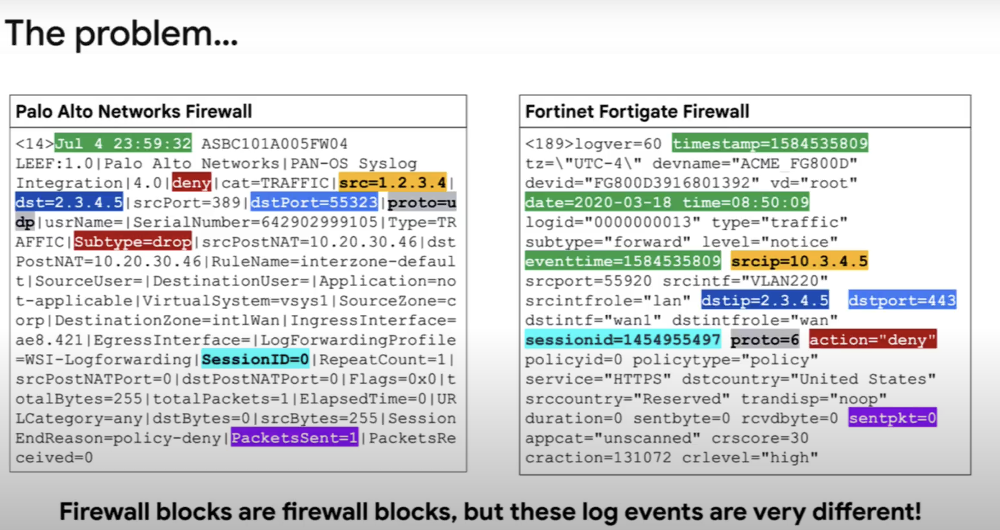
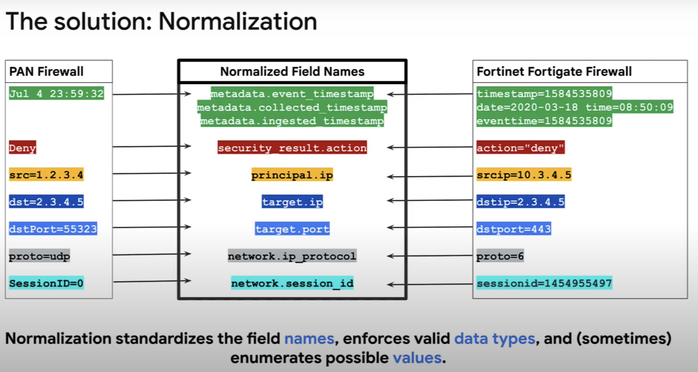
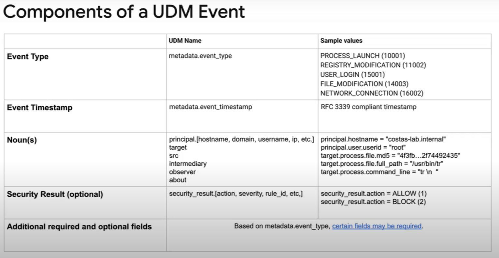

## Fundamentals

<iframe width="560" height="315" src="https://www.youtube.com/embed/5NjLrnH2LfY" title="YouTube video player" frameborder="0" allow="accelerometer; autoplay; clipboard-write; encrypted-media; gyroscope; picture-in-picture; web-share" allowfullscreen></iframe>

Overview:

- Dave Harold, a Principal Security Strategist at Google Cloud, is providing an overview of the Chronicle Unified Data Model (UDM).
- This will cover the need for normalization in security analytics and how UDM normalization works in Chronicle.

The Need for Normalization:

- Security is a data problem, organizations gather large amounts of security data daily, but there are challenges in using this security telemetry.
- The data is unstructured or multi-structured, and each source can use a different format.
- The field names can vary widely from one data source to another, making it difficult to write alerts or perform analysis.
- Therefore, a common way to represent security data is needed, starting with normalizing field names.

UDM Normalization in Chronicle:

- Chronicle uses UDM to represent security telemetry.
- Parsers within Chronicle convert raw logs into UDM.
- Normalized data is available for detection rules, search, and analytics.
- Normalization simplifies detection rules, avoids search time field extraction, and allows for shared content repositories.
- UDM supports entity data and relationships for contextual enrichment.
- Chronicle makes normalization easy with a comprehensive structured UDM, a large default parser library, and support for custom log formats.

UDM Events:

## What is Chronicle?

<iframe width="560" height="315" src="https://www.youtube.com/embed/2IK6p6JNYIU" title="YouTube video player" frameborder="0" allow="accelerometer; autoplay; clipboard-write; encrypted-media; gyroscope; picture-in-picture; web-share" allowfullscreen></iframe>

model (UDM) for security data. It is designed to address the challenge of making sense of the large volumes of unstructured and multi-structured security data that organizations gather on a daily basis.

The advantages of Chronicle include:

- Normalization: Chronicle provides a common way to represent security data by normalizing field names and standardizing the values of fields, which makes it easier to analyze and understand the data.

- Speed: Normalized data can be indexed, making searches in Chronicle lightning fast.

- Shared language: Chronicle provides a common language for security telemetry, which means that security analysts can work more efficiently.

- Simplification of detection rules: By normalizing the data, product-specific terminology is abstracted away, which simplifies the creation and maintenance of detection content.

- Shared content repositories: Chronicle provides access to shared content repositories that contain rules written by people all around the world, which are expressed using UDM.

- Avoidance of expensive search time: By normalizing the data once at ingestion time, Chronicle avoids expensive search time field extraction found in some legacy security information and event management (SIEM) systems.

- Contextual enrichment: Chronicle supports entity data and entity relationships, which allows it to understand details about users, systems, and applications. This contextual data is then used to enrich views in Chronicle and to write better detection rules.

- Comprehensive: Chronicle's UDM is comprehensive and structured to capture complex events and entity data, and it ships with a large default parser library that covers hundreds of different security tools.

- Parser extensions: If a parser needs to be augmented, customers can easily add additional field normalization using parser extensions.

- Raw log search: Raw log search is available within Chronicle, so customers can search against the data just as it was created by the source system.

Note: YARA-L Languages For wrtting Chronicle rule

## Demo

<iframe width="560" height="315" src="https://www.youtube.com/embed/VEUTofLMQJo" title="YouTube video player" frameborder="0" allow="accelerometer; autoplay; clipboard-write; encrypted-media; gyroscope; picture-in-picture; web-share" allowfullscreen></iframe>
qy
Chrinicles Dashboards built upon the capabilities of looker(visual layer) and bigquery (data layer).
